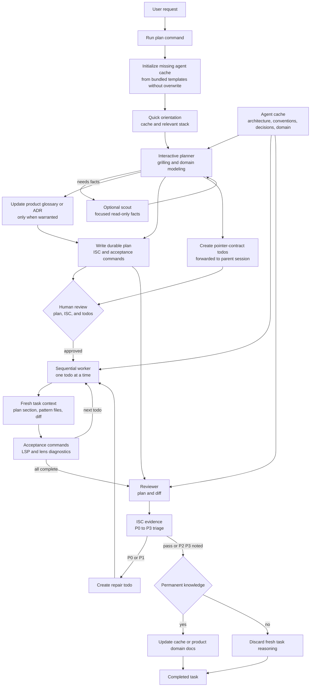

# pi-herdr-subagents-planning

**One `pi` package for the entire `/plan` grill-and-plan workflow on `herdr` subagents.**

`pi-herdr-subagents-planning` bundles the whole pipeline into a single install (V3: cached + fresh contexts):

```
Cached context (.agent/)  →  architecture, conventions, decisions, domain (stable, reused)
Fresh context (per task)  →  request + relevant files + plan + diff (small, independent)

Phase 1  quick orientation          (main session, ~30s — checks .agent/ + stack)
Phase 2  Grill-and-Plan planner     (interactive, one session — grilling + domain-modeling → plan.md + pointer todos)
       ↳ Scout (optional, only for unfamiliar/large areas)
Phase 3  human gate                 (verify plan.md + ISC + todos)
Phase 4  sequential workers         (pointer-contract, one worker per todo — cached + plan § + relevant source)
Phase 5  reviewer                   (ISC evidence + P0-P3 triage — cached + plan + diff)
Phase 6  knowledge update           (permanent knowledge → .agent/, task reasoning discarded)
```

## Workflow graph



`CONTEXT.md` and ADRs model the product domain; `.agent/` models durable project knowledge. The plan, scout report, source reads, diff, and test evidence are fresh task context and are not promoted unless they become permanent.

Install once, get the slash commands, every agent, every skill, todo forwarding, and diagnostics — no five-package choreography. On the first `/plan` (or `session_start`), the extension worktree-aware primes the target project's `.agent/` cache — copies from `main` in a worktree, otherwise mines via `primer` scout — without overwriting existing knowledge.

```bash
pi install npm:pi-herdr-subagents-planning
# or local dev
pi install ./pi-herdr-subagents-planning
# try without persisting
pi -e ./pi-herdr-subagents-planning
```

Then inside `herdr`:

```
/plan Add a dark-mode toggle to the settings page
```

---

## Why a single package?

The V2 workflow was spread across global installs and hand-maintained agent overrides:

- the **subagents runtime** (`pi-herdr-subagents`)
- the **todo overlay** (`@juicesharp/rpiv-todo`)
- the **diagnostics lens** (`pi-lens`)
- two **local skills** (`grilling`, `domain-modeling`)
- a **global extension** (`planner-todo-forward.ts`) that shuttled planner todos back to the parent session

Keeping those in sync across machines was brittle. This package vendors the workflow and **acknowledges every baseline it composes** via `dependencies` + `bundledDependencies` + the table below, so `pi install` pulls one tarball that contains the whole graph with pinned versions.

---

## What's inside

### Extensions (loaded via `pi.extensions`)

| Extension | Source in this package | Baseline | What it does |
| --- | --- | --- | --- |
| `herdr-subagents` | `extensions/herdr-subagents/index.ts` (vendored) | `pi-herdr-subagents@^0.1.7` | `subagent` / `subagent_resume` / `subagent_interrupt` / `subagents_list`, `/plan` / `/prime` / `/iterate` / `/subagent` slash commands, herdr pane lifecycle, model routing (`config.json`), status widget, worktree-aware `prime` (copy-from-`main` vs `primer` scout) |
| `planner-todo-forward` | `extensions/planner-todo-forward.ts` | previously `~/.pi/agent/extensions/planner-todo-forward.ts` (global) | ensures the interactive planner's todos land in the **parent** session (sidecar + live-store import) instead of dying with the ephemeral planner session |
| `rpiv-todo` | `node_modules/@juicesharp/rpiv-todo/index.ts` | `@juicesharp/rpiv-todo@^2.7.1` | `todo` tool, live overlay, replay, blockedBy graph, persistence |
| `pi-lens` | `node_modules/pi-lens/dist/index.js` | `pi-lens@^3.8.74` | LSP + Biome/Ruff/ast-grep/knip/jscpd diagnostics for workers (`lens_diagnostics`, `lsp_diagnostics`, `symbol_search`, `module_report`, …) |

> The `herdr-subagents` extension is **vendored** rather than loaded from `node_modules/pi-herdr-subagents/...` so the V2 agent prompts (planner's `Do not suggest a recommended answer`, exit-gate, worker pointer-contract,…) ship with the package even though the upstream npm tarball may lag behind local V2 snapshots. The original source is acknowledged as the baseline and kept in `dependencies`/`bundledDependencies` for traceability.

### Agents (vendored in `agents/`)

| Agent | Model (default) | Role |
| --- | --- | --- |
| `planner` | `openai-codex/gpt-5.6-sol` | one-session griller + planner: design-tree rounds → `CONTEXT.md`/`docs/adr` → pointer `plan.md` + pointer todos |
| `worker` | `opencode-go/muse-spark-1.2-contributor` | pointer-task executor: resolves pattern from code, grounds APIs via `query-docs`/`symbol_search`, runs acceptance commands, `lsp_diagnostics`/`lens_diagnostics` clean, commits, closes todo |
| `scout` | `openai-codex/gpt-5.6-luna` | fast read-only reconnaissance for facts the planner needs |
| `primer` | `openai-codex/gpt-5.6-luna` | `.agent` cache primer: mines architecture/conventions/decisions/domain from repo (spawned by `/prime` mine path, idempotent) |
| `reviewer` | `openai-codex/gpt-5.6-terra` | ISC-evidence review against `plan.md` + `CONTEXT.md` + ADRs, P0-P3 triage |
| `visual-tester` | (inherits `models.default`) | Chrome-CDP visual QA (bundled from upstream) |

Model routing is fixed via `config.json` (`models.default` → `models.agents.<role>`) — no per-run picker. Overrides follow `tool-arg → agent frontmatter → per-agent config → global default → parent model`.

### Skills (vendored in `skills/`)

| Skill | Source | Baseline | Used by |
| --- | --- | --- | --- |
| `grilling` | `skills/grilling/SKILL.md` | `~/.agents/skills/grilling` (local) | planner's design-tree frontier |
| `domain-modeling` | `skills/domain-modeling/` (`SKILL.md` + `ADR-FORMAT.md` + `CONTEXT-FORMAT.md`) | `~/.agents/skills/domain-modeling` (local) | planner's glossary/ADR discipline (`CONTEXT.md`, `docs/adr/NNNN-*.md`) |

Skills declare `name` + `description` in `SKILL.md` frontmatter; they are discovered via `pi.skills` manifest entries.

### Config

`config.json.example` mirrors the upstream `pi-herdr-subagents` example:

```json
{
  "status": { "enabled": true },
  "models": {
    "default": "opencode-go/muse-spark-1.2-contributor",
    "agents": {
      "planner": "openai-codex/gpt-5.6-sol",
      "worker": "opencode-go/muse-spark-1.2-contributor",
      "reviewer": "openai-codex/gpt-5.6-terra"
    }
  }
}
```

Copy to `config.json` and replace IDs with exact authenticated `provider/model-id` values if you want custom routing. Otherwise the agent frontmatter models above run.

---

## Baseline acknowledgments

This package does not reimplement the workflow from scratch — it composes and vendors the following baselines. All are retained under their original licenses (MIT unless noted) and pinned in `package.json`.

| Baseline | Version pinned | License | NPM / Source | Role in this package |
| --- | --- | --- | --- | --- |
| [`pi-herdr-subagents`](https://github.com/0xRichardH/pi-herdr-subagents) | `^0.1.7` (built 2026-08-25 against `0.1.7`) | MIT | `npm:pi-herdr-subagents` | subagents runtime, `/plan` command, `plan-skill.md`, lifecycle/status/activity/terminal/herdr plugins |
| [`@juicesharp/rpiv-todo`](https://github.com/juicesharp/rpiv-mono) | `^2.7.1` | MIT | `npm:@juicesharp/rpiv-todo` | todo state/reducer/store/replay + overlay |
| [`pi-lens`](https://github.com/apmantza/pi-lens) | `^3.8.74` | MIT | `npm:pi-lens` | diagnostics, LSP, ast-grep, lint, complexity |
| `grilling` skill | snapshot 2026-08-25 | — (local skill, MIT-compatible) | `~/.agents/skills/grilling/SKILL.md` | design-tree grilling engine |
| `domain-modeling` skill | snapshot 2026-08-25 | — (local skill, MIT-compatible) | `~/.agents/skills/domain-modeling/*` | glossary/ADR discipline |
| `planner-todo-forward` extension | snapshot 2026-08-25 | MIT | `~/.pi/agent/extensions/planner-todo-forward.ts` | cross-session todo forwarding |

Peer dependencies are **not** bundled (per `packages.md` guidance): `@earendil-works/pi-ai`, `@earendil-works/pi-coding-agent`, `@earendil-works/pi-tui`, `typebox` remain `peerDependencies: "*"` and are provided by the pi runtime.

Vendored sources preserve upstream attribution comments where present (e.g. `herdr:pi` integration header, skill frontmatter `name`/`description`).

### How baselines are bundled

`package.json` declares:

```json
{
  "dependencies": {
    "pi-herdr-subagents": "^0.1.7",
    "@juicesharp/rpiv-todo": "^2.7.1",
    "pi-lens": "^3.8.74"
  },
  "bundledDependencies": ["pi-herdr-subagents", "@juicesharp/rpiv-todo", "pi-lens"],
  "pi": {
    "extensions": [
      "./extensions/herdr-subagents/index.ts",
      "./extensions/planner-todo-forward.ts",
      "node_modules/@juicesharp/rpiv-todo/index.ts",
      "node_modules/pi-lens/dist/index.js"
    ],
    "skills": ["./skills/grilling", "./skills/domain-modeling"]
  }
}
```

- `dependencies` + `bundledDependencies` guarantee `npm pack` / `pi install` embeds the baselines in the tarball and `npm install` hoists them under `node_modules/` (so `pi-lens` grammars, `@juicesharp/rpiv-config`, etc. resolve).
- `pi.extensions` / `pi.skills` use **local vendored paths** for `herdr-subagents` + the two skills, and **`node_modules/` paths** for `rpiv-todo` + `pi-lens`, exactly as prescribed in `packages.md` (`"extensions": ["extensions", "node_modules/shitty-extensions/extensions"]`).
- Pi loads packages with separate module roots, so separate global installs do not collide.

To update a baseline: bump the version in `dependencies`, run `npm install`, re-vendor the changed source files if vendored, and record in `CHANGELOG.md`.

---

## Usage

Requires `herdr` (the only supported terminal) with `HERDR_ENV=1`.

```bash
herdr
pi
/prime            # optional: explicitly prime .agent (worktree→copy from main, else primer scout)
/plan <your request>
```

The slash commands are `extensions/herdr-subagents/plan-skill.md` (V3: cached + fresh). The main agent then:

1. `session_start` worktree-aware prime (copy-from-`main` in worktree, else heuristic mine) — no manual step needed; `/prime` is the explicit deep variant (spawns `primer` scout when `.agent` is stub)
2. ~30s orientation (`ls .agent/`, `find`, `package.json` peek) then spawns one interactive `planner` (`interactive: true`) — loads cached context, grill rounds until frontier empty → writes `.agent/plans/YYYY-MM-DD-<name>/plan.md` + `CONTEXT.md`/`docs/adr` + pointer todos (forwarded to parent)
3. human gate (you review ISC + todos)
4. sequential `worker` loop — each worker loads cached context + `plan.md` § + pattern file only (`caller_ping` on ambiguity); scout only if unfamiliar/large
5. `reviewer` against ISC/acceptance commands (cached + plan + diff)
6. knowledge update — permanent decisions/conventions → `.agent/`, task reasoning discarded

Artifacts: `.agent/plans/<name>/plan.md`, `.agent/*.md` (cached), `CONTEXT.md`, `docs/adr/NNNN-*.md`, todos in session.

---

## Development

```bash
npm install          # pulls bundled baselines for local dev
npm pack --dry-run   # verify files + bundled tarballs
pi install ./        # test local install (project-scope: pi install -l ./)
```

Lint / typecheck vendored extensions via project `tsc` if present.

---

## License

MIT — see [LICENSE](./LICENSE). Baselines retain their own MIT licenses (see table above). This package's vendored copies preserve upstream license headers and are licensed compatibly.
